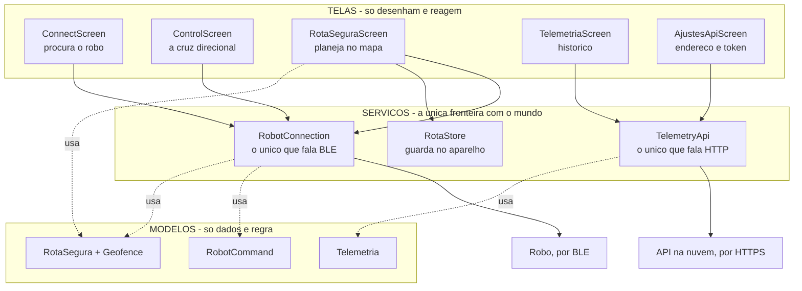
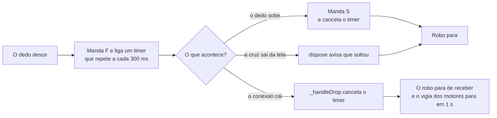
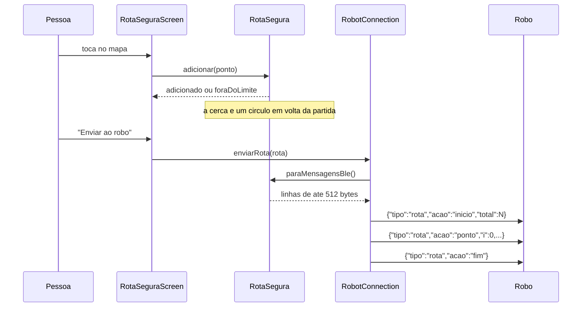

# Como funciona o `aplicativo`

> **Para quem nunca viu este projeto.** Este documento é um passeio guiado pelo
> código: o que cada tela faz, por onde os dados passam, e por que o desenho é
> esse. Leva uns dez minutos e não exige ter o robô por perto.
>
> - Quer o **mapa de arquivos** e as decisões de design? → [`ARQUITETURA.md`](./ARQUITETURA.md)
> - Quer **buildar e publicar**? → [`README.md`](./README.md)
> - Quer ver como os **três repositórios** se encaixam?
>   → [`../orquestrador/MAPA-COMUNICACAO.md`](../orquestrador/MAPA-COMUNICACAO.md)

---

## 1. Em uma frase

Este repositório é **o controle da Atlas**: um app Flutter (Android e iOS) que
dirige o robô por Bluetooth e mostra o que ele fez, lido de um banco na nuvem.

São duas conversas bem diferentes, e o app é praticamente duas metades por causa
disso:

| | Dirigir | Ver os dados |
|---|---|---|
| **Transporte** | BLE (Nordic UART) | HTTP (FastAPI) |
| **Alcance** | Uns 10 metros, robô ligado | De qualquer lugar, robô desligado |
| **Direção** | O app escreve | O app só lê |
| **Arquivo** | `services/robot_connection.dart` | `services/telemetry_api.dart` |

É por isso que a tela de dados sai da tela de **conexão**, e não da de controle:
quem abre o app para ver onde o robô andou ontem não deveria precisar parear
nada antes.

---

## 2. A regra de ouro

> **As telas não sabem de onde vêm os dados. Quem busca os dados não sabe o que
> é tela.**

Só **dois** arquivos do app inteiro falam com o mundo externo. Nenhuma tela abre
uma conexão, nenhuma tela monta uma requisição.



Trocar o BLE por Wi-Fi, ou a API por outra coisa, reescreve **um** arquivo e
mais nenhum.

---

## 3. O caminho de um toque no botão

Alguém encosta o dedo em **FRENTE**:

| # | Onde | O que acontece |
|---|---|---|
| 1 | `widgets/direction_pad.dart` | `onTapDown` dispara. Uma vibração curta — num controle que se usa olhando para o **robô**, e não para a tela, o toque no dedo é o único retorno que chega. |
| 2 | `screens/control_screen.dart` | Chama `robot.send(RobotCommand.forward)`. A tela não sabe o que é Bluetooth. |
| 3 | `services/robot_connection.dart` | Monta `{"cmd":"F"}\n` e escreve na característica RX, com `withoutResponse`. |
| 4 | idem | **Liga um timer que repete o mesmo comando a cada 300 ms.** Esta linha é a mais importante do arquivo — ver [§5](#5-a-parte-que-precisa-estar-certa-o-robô-não-pode-sair-andando). |
| 5 | O dedo sobe | `onTapUp` → `onRelease` → `send(RobotCommand.stop)`, que cancela o timer e manda `{"cmd":"S"}`. |

E o caminho de um gráfico na tela de telemetria:

| # | Onde | O que acontece |
|---|---|---|
| 1 | `screens/telemetria_screen.dart` | A tela abre, ou alguém puxa para atualizar. **Não há polling**: os dados não chegam sozinhos. |
| 2 | `services/telemetry_api.dart` | `GET /v1/serie/bateria?campo=percentual&intervalo=1h`, com `Authorization: Bearer`. Um `http.Client` só, reaproveitado — um cliente novo por requisição refaria o aperto de mão TLS toda vez. |
| 3 | idem | Traduz a falha para o que a pessoa tem de conferir: “a API não respondeu a tempo”, “token recusado”, “o Android bloqueou porque o endereço é http://”. Nunca um `SocketException` cru na tela. |
| 4 | `models/telemetria.dart` | `PontoSerie.fromJson`, **tolerante**: campo ausente ou com tipo errado vira `null`, nunca uma exceção. |
| 5 | `widgets/grafico_serie.dart` | Desenha. |

---

## 4. As peças, uma a uma

### As cinco telas

| Tela | Quando aparece | O que faz |
|---|---|---|
| **`ConnectScreen`** | Ao abrir o app | Escaneia por quem anuncia o serviço BLE do Atlas. É a porta de entrada para as outras duas rotas: controlar e ver dados. |
| **`ControlScreen`** | Depois de conectar | A cruz direcional e o estado da conexão. Envolvida por um `ListenableBuilder`: quando a conexão cai sozinha, a tela se redesenha e o indicador fala a verdade. |
| **`RotaSeguraScreen`** | Da tela de controle | Desenha waypoints num mapa OpenStreetMap, dentro de uma cerca. |
| **`TelemetriaScreen`** | Da tela de conexão | Painel, mapa do trajeto, gráficos e a lista de eventos crus. |
| **`AjustesApiScreen`** | Da tela de telemetria | Endereço e token da API — e **testa antes de salvar**. |

### Os dois serviços

**`RobotConnection`** — um `ChangeNotifier` singleton. É `ChangeNotifier` porque
a conexão pode cair sozinha (robô desligou, saiu do alcance); quando isso
acontece, `notifyListeners()` avisa as telas, que se redesenham sem nenhum
polling.

**`TelemetryApi`** — deliberadamente **não** é um `ChangeNotifier`. A telemetria
não chega sozinha: as telas pedem quando abrem e quando a pessoa puxa para
atualizar. Um `ChangeNotifier` aqui daria a impressão de que os dados se
atualizam sozinhos, o que não é verdade.

### Os modelos

- **`RobotCommand`** — um enum com a letra que vai no rádio. Adicionar um comando
  novo é uma linha aqui e o firmware entender a letra.
- **`telemetria.dart`** — as quatro formas que a API devolve. Todos os `fromJson`
  são tolerantes, e o motivo está escrito no arquivo: o payload é JSON livre, e
  um app que quebra a tela porque o GPS parou de mandar `satelites` seria pior
  que um que mostra um traço no lugar.
- **`rota_segura.dart`** — os waypoints, a cerca e o fatiamento para o BLE. **Só
  dados e regra**: não conhece mapa nem Bluetooth, e é por isso que dá para
  testá-lo sem celular e sem robô.

---

## 5. A parte que precisa estar certa: o robô não pode sair andando

O app manda `F` quando o dedo desce e `S` quando o dedo sobe. **Entre os dois
não passa nada.** Se a conexão morrer justamente nesse intervalo — o celular
saiu de alcance, ficou sem bateria, o app foi fechado —, o `S` nunca chega e o
robô fica andando sozinho.

A solução não é um comando a mais. É **inverter o significado do silêncio**:



O serviço `motores`, do outro repositório, para os motores depois de **1 segundo
sem receber nada**. Com a repetição a cada 300 ms, isso dá margem para três
mensagens perdidas antes de o robô parar sozinho — e faz o silêncio significar
“pare”, que é a interpretação segura.

Três coisas neste repositório sustentam isso, e todas têm teste:

1. `send()` liga o timer só para comandos de movimento — `stop` não se repete.
2. `_handleDrop()` cancela o timer quando a conexão cai. Sem isso, ele
   continuaria acordando para escrever numa característica que não existe mais,
   uma vez a cada 300 ms, para sempre.
3. `_PadButtonState.dispose()` avisa que soltou quando o botão sai da tela com o
   dedo ainda apertado.

---

## 6. A rota segura

A rota é **planejada no app** e serve de guia; o robô ainda não a segue sozinho.
O que existe é o caminho de *entregar e validar*:



**Por que fatiada:** uma linha BLE não passa de 512 bytes no firmware do ESP32.
Cada linha da rota fica em ~65 bytes, com folga.

**Por que a cerca:** ela impede desenhar uma rota que sai da área combinada. E,
do outro lado, o `orquestrador` descarta coordenada ou índice inválidos de novo
— porque a origem (o app) é entrada não-confiável mesmo tendo sido escrita por
nós.

---

## 7. As decisões que explicam o desenho

**1. Duas metades que não se misturam.** O BLE só funciona perto do robô ligado;
a API funciona de qualquer lugar. Misturar as duas numa tela só faria a
telemetria parecer indisponível sempre que o robô estivesse desligado — que é
justamente quando se quer olhar o histórico.

**2. Erro é texto que a pessoa entende.** `SocketException: Failed host lookup`
diz o que aconteceu na camada de rede, não o que a pessoa tem de conferir.
`telemetry_api.dart` traduz cada falha, e a tela de ajustes **testa antes de
salvar** — descobrir o endereço errado só na tela do mapa, como uma lista vazia,
manda procurar o problema no robô, que estará funcionando.

**3. Nada que venha da rede pode quebrar a tela.** Todo `fromJson` é tolerante e
descarta o que não deu para ler. Um ponto malformado no meio de mil não vale
perder os outros novecentos e noventa e nove.

**4. O token não é segredo de verdade, e isso está escrito.** Ele fica em
`SharedPreferences`, legível num aparelho com root ou num backup. É aceitável
porque só dá **leitura** da telemetria de um robô escolar. Se um dia der acesso
a mais que isso, o lugar passa a ser `flutter_secure_storage`.

---

## 8. Coisas de infraestrutura que já custaram tempo

| Detalhe | Por que existe |
|---|---|
| `License.nonprofit` em `device.connect()` | Exigido pela licença do `flutter_blue_plus`. Este é um projeto acadêmico sem fins lucrativos (PIE da Setrem). Não troque para `commercial` sem entender a licença. |
| `kotlin.incremental=false` | Sem essa linha o build morre em `compileDebugKotlin` com *“Could not close incremental caches”* — acontece com o projeto num drive montado ou com antivírus segurando os arquivos. |
| Guarda de `defaultTargetPlatform` antes de pedir permissão | O `permission_handler` não tem implementação para desktop. Pedir permissão fora de Android/iOS lança `MissingPluginException`. |
| A atribuição no rodapé do mapa | Exigida pela licença do OpenStreetMap (ODbL). **Não remova.** |
| Trocar o ícone exige release novo | É recurso nativo; nenhum patch do Shorebird o entrega. |

---

## 9. Mexendo no código

```bash
flutter pub get
flutter analyze          # tem de estar sempre limpo
flutter test             # 32 testes, sem celular e sem robô

flutter run -d linux     # roda no computador, com Bluetooth real (BlueZ)
flutter build apk --debug

# APK já apontando para a API, sem precisar configurar na tela:
flutter build apk --release \
  --dart-define=ATLAS_API_URL=https://api.seudominio.com.br \
  --dart-define=ATLAS_API_TOKEN=o-token-do-.env-da-VM
```

**Entrega contínua:** todo push na `main` dispara o Shorebird
(`.github/workflows/deploy.yml`). Se a `version:` do `pubspec.yaml` já tem
release, sobe um **patch** — o código Dart novo viaja pela rede e o app se
atualiza sozinho no próximo abrir. Se a versão é nova, sobe um **release**
completo com APK assinado.

Patch não consegue trocar código nativo (Kotlin, `AndroidManifest`, plugin novo,
versão do Flutter). Ao mexer nisso, suba a `version:` — senão o passo de patch
falha de propósito, avisando que precisa de release novo.

---

## 10. Onde continuar lendo

| Documento | Para quê |
|---|---|
| [`ARQUITETURA.md`](./ARQUITETURA.md) | O mapa de arquivos e as decisões de design, em detalhe |
| [`README.md`](./README.md) | Instalar, buildar, publicar |
| [`CLAUDE.md`](./CLAUDE.md) | Convenções e contexto do projeto maior |
| [`../orquestrador/MAPA-COMUNICACAO.md`](../orquestrador/MAPA-COMUNICACAO.md) | As fronteiras entre os três repositórios |
